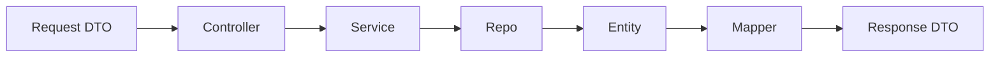

# DTOs, Mapper y Entities en LabLink

## ¿Qué es cada cosa?

### DTO (Data Transfer Object)

Define la forma exacta de los datos que la API acepta (input) y devuelve (output). Sirve para validar el contrato público y proteger el backend. Se implementa con Zod en:
`src/modules/[modulo]/dto/[modulo].dto.ts`

**Ejemplo:**

```typescript
export const equipmentCreateDto = z.object({
  name: z.string(),
  type: z.string().optional(),
  laboratoryId: z.number().int(),
});
```

### Entity

Representa la estructura de los datos en la base de datos o el dominio. Puede incluir lógica de negocio simple o métodos relacionados al modelo. Se define en:
`src/modules/[modulo]/entities/[modulo].entity.ts`

**Ejemplo:**

```typescript
export class EquipmentEntity {
  id: number;
  name: string;
  type?: string;
  laboratoryId: number;
  // ...otros campos
}
```

### Mapper

Transforma datos crudos (de la DB o de la request) en DTOs seguros para la API. Evita exponer campos internos o sensibles. Se implementa en:
`src/modules/[modulo]/[modulo].mapper.ts`

**Ejemplo:**

```typescript
export function toEquipmentReadDto(row: EquipmentEntity): EquipmentReadDto {
  return {
    id: row.id,
    name: row.name,
    type: row.type,
    laboratoryId: row.laboratoryId,
    // ...otros campos
  };
}
```

## Tipos de DTOs

### Request DTO (entrada)
- Valida y limita lo que el cliente puede enviar.
- Ejemplo: `CreateEquipmentDto` para POST /equipment.

### Response DTO (salida)
- Controla y documenta lo que la API devuelve.
- Ejemplo: `EquipmentReadDto` para GET /equipment/:id o la respuesta de POST.

## Flujo de desarrollo con estos conceptos

1. **Request DTO**: El cliente envía datos → validados con el DTO de entrada.
2. **Controller**: Recibe el request, valida y pasa los datos al service.
3. **Service**: Orquesta la lógica, llama al repo y recibe datos crudos (entity).
4. **Repository**: Accede a la base de datos y devuelve entities.
5. **Mapper**: Convierte entity a Response DTO.
6. **Controller**: Responde al cliente con el Response DTO seguro.

**Diagrama:**



## Resumen

- **DTO**: Contrato público, validación.
- **Entity**: Modelo interno/dominio.
- **Mapper**: Traducción segura entre entity y DTO.
- El flujo asegura seguridad, claridad y mantenibilidad en la API.
